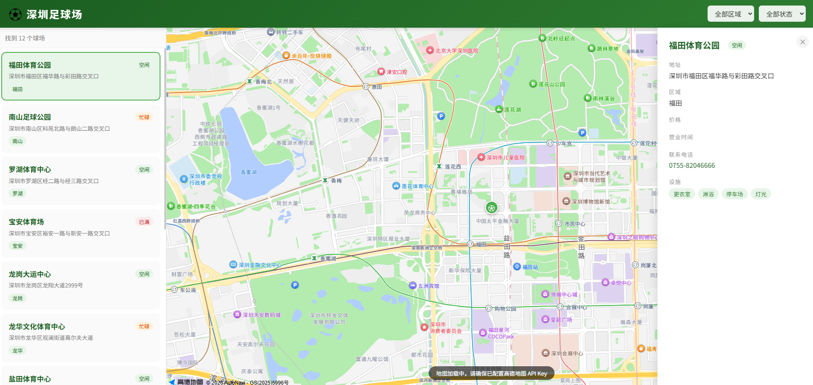

# 深圳足球场查找网站
Vue 3 + Go Gin 前后端分离项目，帮助深圳用户查找附近足球场。



## 项目结构

```
soccer/
├── backend/          # Go + Gin 后端 (端口 8080)
│   ├── main.go
│   └── go.mod
├── frontend/        # Vue 3 + Vite 前端
│   ├── src/
│   │   ├── App.vue
│   │   └── main.js
│   └── index.html
└── SPEC.md
```

## 快速启动

### 1. 启动后端

```bash
cd backend
go mod tidy
go run main.go
```

API 启动在 `http://localhost:8080`

### 2. 启动前端

```bash
cd frontend
npm install
npm run dev
```

前端启动在 `http://localhost:5173`

### 3. 配置高德地图

1. 前往 [高德开放平台](https://lbs.amap.com/) 注册账号并申请 Web JS API Key
2. 编辑 `frontend/index.html`，将 `YOUR_AMAP_KEY` 替换为你的 Key

## 功能

- 🗺️ 高德地图展示深圳所有球场位置
- 📋 左侧球场列表，支持筛选区域和状态
- ⚽ 点击标注查看球场详情（地址、价格、设施、联系电话）
- 🔍 按区域（福田/南山/罗湖等）和状态（空闲/忙碌/已满）筛选
- 📱 响应式详情面板

## API 接口

| 接口 | 说明 |
|------|------|
| GET /api/fields | 获取所有球场 |
| GET /api/fields/:id | 获取单个球场详情 |
| GET /api/districts | 获取区域列表 |
| GET /api/statuses | 获取状态列表 |
| GET /api/fields?district=福田&status=available | 按条件筛选 |
